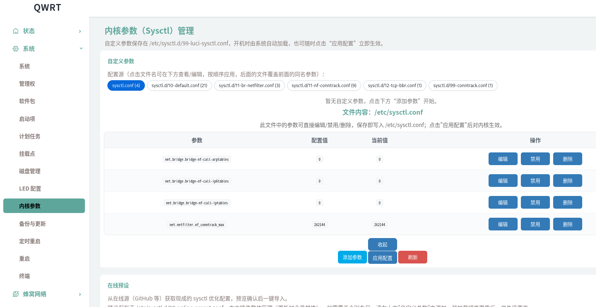
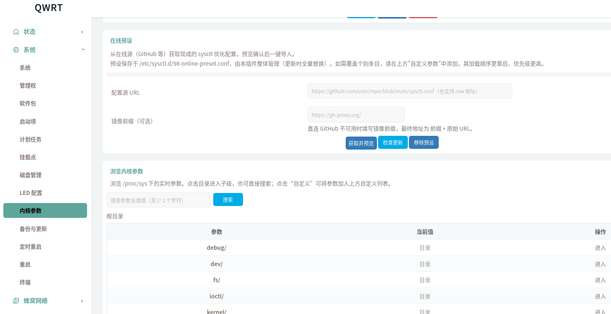
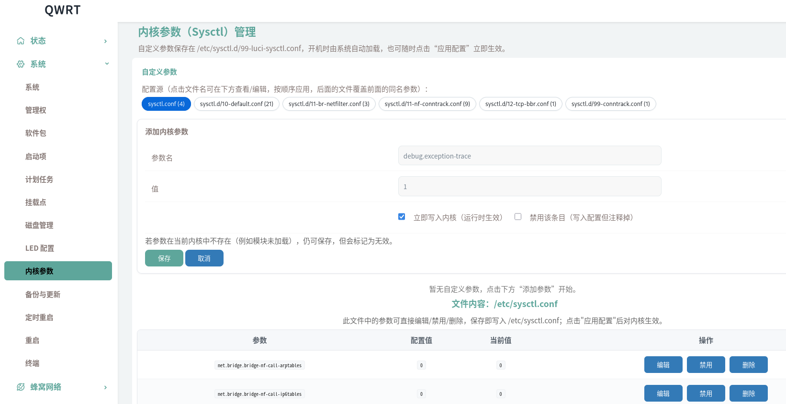

# luci-app-sysctl

OpenWrt 24.10 的内核参数（sysctl）LuCI 管理界面：无需命令行，在浏览器里查看、修改、应用 sysctl 参数。

## 界面预览

**主界面：配置源标签、文件参数编辑与在线预设**



**在线预设与浏览内核参数**



**配置源查看/编辑与添加参数表单**



**添加参数与同名参数实时提醒**


## 功能

- **自定义参数管理**：在 `/etc/sysctl.d/99-luci-sysctl.conf` 中增删改参数，开机自动加载，升级系统时文件作为 conffiles 保留
- **配置源直接编辑**：点击页面顶部任意配置源标签（含系统主配置 `/etc/sysctl.conf`），在下方内联查看/编辑该文件内的参数（改值、禁用、删除，保留原文件注释与顺序）；插件管理的两个文件（98/99）不在此入口，防误改
- **在线预设**：从 GitHub 等在线源获取现成的 sysctl 优化配置，预览/冲突提示后一键导入 `/etc/sysctl.d/98-online-preset.conf`（由插件整体管理），支持镜像加速与一键检查更新（自动对比新增/变更/移除）
- **状态一目了然**：每个参数显示 配置值 / 当前生效值 / 状态徽章（已生效、未应用、无效参数、已禁用）
- **一键应用**：按顺序对所有配置源执行 `sysctl -e -p`，立即生效并展示每个文件的报错明细
- **单个参数立即生效**：保存时可直接写入 `/proc/sys`（运行时生效），只读参数会给出提示
- **禁用而不删除**：条目以 `# key = value` 形式注释保存，随时可恢复
- **同名参数检测与提醒**：一键扫描所有配置源，找出被多个文件重复定义的参数并标出最终生效来源，支持一键清理；添加/编辑参数时若同名参数会覆盖（或被覆盖）自动提醒，避免“改了不生效”的困惑
- **浏览 / 搜索全部内核参数**：树形浏览 `/proc/sys`（dev / fs / kernel / net / vm ...），目录行标有“目录”标识与“进入”链接，子级页面有“返回上一级”与面包屑导航；从浏览/搜索发起的自定义编辑保存后会自动滚回浏览区；支持按参数名或值全文搜索，找到后一键加入自定义列表

依赖：`luci-base`、`rpcd`、`rpcd-mod-ucode`（OpenWrt 24.10 自带或自动安装）。界面语言跟随 LuCI（本插件界面文案为中文）。

## 目录结构

```
luci-app-sysctl/
├── Makefile                        # OpenWrt 包定义（luci.mk）
├── build-ipk.sh                    # 免 SDK 打包 .ipk 脚本
├── screenshots/                    # 界面截图（README 引用）
│   ├── 1.png
│   ├── 2.png
│   ├── 3.png
│   └── 4.png
├── htdocs/
│   └── luci-static/resources/view/
│       └── sysctl.js               # 前端页面（客户端渲染 view）
└── root/
    ├── etc/sysctl.d/
    │   └── 99-luci-sysctl.conf     # 自定义参数存储（conffile）
    └── usr/share/
        ├── luci/menu.d/
        │   └── luci-app-sysctl.json # 菜单：系统 -> 内核参数
        └── rpcd/
            ├── ucode/luci.sysctl   # rpcd ucode 后端（ubus 对象 luci.sysctl）
            └── acl.d/
                └── luci-app-sysctl.json # ACL 权限声明
```

## 安装方式一：OpenWrt SDK / buildroot 编译（推荐）

在 OpenWrt 24.10 的 buildroot 或 SDK 中：

```sh
# 1. 准备 luci feed（SDK 通常已具备）
./scripts/feeds update luci
./scripts/feeds install luci-base rpcd rpcd-mod-ucode

# 2. 放入包源码（二选一）
cp -a luci-app-sysctl package/                 # 方式 A：作为独立 package
cp -a luci-app-sysctl feeds/luci/applications/ # 方式 B：放进 luci feed

# 3. 选择并编译
make menuconfig   # LuCI -> Applications -> <*> luci-app-sysctl
make package/luci-app-sysctl/compile V=s

# 产物：bin/packages/<arch>/luci-app-sysctl_1.7.1-1_all.ipk
```

> 放在 `package/` 下时 Makefile 会引用 `feeds/luci/luci.mk`，因此仍需 luci feed 已安装。

## 安装方式二：免编译直接打包 ipk

在没有 SDK 的 Linux 机器上，直接用 `build-ipk.sh` 打包（产物为 `all` 架构，与 CPU 无关）：

```sh
./build-ipk.sh
# -> luci-app-sysctl_1.7.1-1_all.ipk
```

传到路由器安装：

```sh
scp luci-app-sysctl_1.7.1-1_all.ipk root@192.168.1.1:/tmp/
ssh root@192.168.1.1 "opkg install --force-reinstall /tmp/luci-app-sysctl_1.7.1-1_all.ipk"
```

> 升级提示：仅前端页面（`sysctl.js`）有变化时，安装后刷新浏览器即可；后端 `luci.sysctl`（rpcd ucode）有变化时，还需执行 `/etc/init.d/rpcd restart`。不确定时升级后一律重启一次 rpcd 最稳妥。

安装脚本会自动重启 rpcd 并刷新 LuCI 菜单缓存；若菜单未出现，手动执行：

```sh
/etc/init.d/rpcd restart && rm -f /tmp/luci-indexcache*
```

然后刷新浏览器，菜单位于 **系统 -> 内核参数**。

## 使用说明

| 操作 | 说明 |
|---|---|
| 添加参数 | 「自定义参数」区点击 **添加参数**，填入参数名与值；可勾选"立即写入内核"马上生效；无自定义参数时表格隐藏，仅显示一行提示 |
| 编辑/禁用/删除 | 每行右侧按钮；禁用仅注释配置行，删除则从配置文件移除 |
| 配置源标签 | 点击顶部配置源标签（含 `/etc/sysctl.conf` 主配置）在下方内联查看/编辑该文件参数，再点一次或点 **收起** 关闭 |
| 应用配置 | 按顺序应用 `/etc/sysctl.conf` 与 `/etc/sysctl.d/*.conf`，内联展示报错明细 |
| 检测重复 | 点击 **检测重复** 扫描所有配置源，列出被多个文件重复定义的参数、各文件取值与最终“生效来源”；可一键从指定文件删除多余条目（建议同名参数只保留一处） |
| 在线预设 | 填入 GitHub 等配置源 URL，点击 **获取并预览** 查看解析结果与冲突提示，确认后 **导入到路由器**；填入的是 **GitHub 目录链接**（`github.com/用户/仓库/tree/分支/目录`）时会自动列出目录下全部 `.conf` 文件供点选；已导入后可 **检查更新**（自动对比新增/变更/移除并可应用）或 **移除预设** |
| 浏览 | 下方"浏览内核参数"区按目录层级浏览 `/proc/sys` 实时值；目录行显示"目录"标识，点参数名或"进入"进子级，面包屑可逐级返回，另有"← 返回上一级"快捷链接 |
| 搜索 | 输入至少 2 个字符自动搜索参数名（值需 3 个字符） |
| 快速自定义 | 浏览/搜索结果点击 **自定义**，自动带出参数名和当前值；保存或取消后页面自动滚回浏览区 |

### 参数生效机制

- 自定义参数保存在 `/etc/sysctl.d/99-luci-sysctl.conf`，开机由 `/etc/init.d/sysctl` 自动加载
- 在线预设保存在 `/etc/sysctl.d/98-online-preset.conf`（加载顺序在 99 之前），插件更新预设时全量替换；想覆盖某条预设值，在"自定义参数"里同名添加即可
- 页面顶部展示所有配置源及其加载顺序（先 `/etc/sysctl.conf`，再 `/etc/sysctl.d/*.conf` 按文件名字典序，后面的同名参数覆盖前面的）
- 想验证系统实际加载顺序，可在路由器上执行 `cat /etc/init.d/sysctl`
- 状态徽章含义：
  - **已生效**（绿）：当前内核值与配置值一致
  - **未应用**（橙）：配置已保存但内核值不同，点击 **应用配置** 即可
  - **无效参数**（红）：`/proc/sys` 下不存在该参数（常见于模块未加载，如未启用 IPv6 时的 `net.ipv6.*`）
  - **已禁用**（灰）：条目被注释，不参与加载

## FAQ

**Q: 页面提示"权限被拒绝 / Not found"？**
rpcd 未注册 `luci.sysctl` 对象或 ACL 未生效：`/etc/init.d/rpcd restart` 后刷新页面。确认 `rpcd-mod-ucode` 已安装：`opkg list-installed | grep rpcd-mod-ucode`。

**Q: 在线预设获取失败？**
1. 直连 GitHub 不可达时，在"镜像前缀"填入加速前缀（如 `https://gh-proxy.org/`），最终地址为 前缀 + 原始 URL；
2. 建议直接使用 `raw.githubusercontent.com` 地址，粘贴 `github.com/.../blob/...` 页面地址会自动转换；
3. 预设源路由器需可解析 DNS 并出网，可先在 SSH 里验证：`curl -fsSL <镜像前缀+URL> | head`；
4. 下载器依次尝试 curl / wget / uclient-fetch，三者都失败时提示 Download failed。

**Q: 保存提示"参数在当前内核中不存在"？**
该 key 在 `/proc/sys` 下无对应节点，多半是功能未编译进内核或模块未加载。配置仍会保存，模块加载后下次开机生效。

**Q: 写入提示只读（readonly）？**
部分参数（如部分 `kernel.*`）在运行时不可写，只能保存配置，重启后由系统应用。

**Q: 修改后重启会丢吗？**
不会。所有修改持久化在 `/etc/sysctl.d/99-luci-sysctl.conf`，该文件已声明为 conffile，系统升级也会保留。

**Q: 和手动编辑 /etc/sysctl.conf 冲突吗？**
不冲突。`/etc/sysctl.conf` 也可直接点击配置源标签在页面编辑，编辑结果与手动改文件完全一致；自定义参数仍推荐放在 `99-luci-sysctl.conf`（文件名靠后、优先级最高）。

**Q: 删除某文件里最后一条参数时提示"删除失败"？**
该问题在 v1.5.3 已修复（旧版误把"成功写入空文件"当失败，实际文件已删净）。如仍遇到请确认已安装 v1.5.3 及以上版本。

**Q: 为什么总览表里看不到 /etc/sysctl.conf 的参数？**
设计如此（v1.5.4 起）：主配置参数统一通过点击 `sysctl.conf` 标签查看/编辑，避免与配置源列表重复展示。

**Q: 明明改了参数、应用配置也成功，为什么当前值没变？**
大概率同名参数被多个文件定义，你的值被后面加载的文件覆盖了（文件名字典序越靠后优先级越高，如 `99-conntrack.conf` 会覆盖 `99-luci-sysctl.conf`）。点击 **检测重复** 可看到完整的定义链与生效来源，按提示删除多余定义或直接编辑生效文件。

## 更新日志

### v1.7.4
- 修复标准 OpenWrt 24.10 主题下操作按钮行（添加参数/应用配置/检测重复/刷新）不居中：新版主题按钮行为 flex 布局（justify-content: flex-end），旧修复仅覆盖 float+text-align 方式；现两种布局方式都强制居中，并统一按钮间距。纯前端改动

### v1.7.3
- 修复"当前值"不刷新：已打开的文件内容面板在点击 **应用配置** / **刷新** 后不重新读取内核值，导致刚应用的参数看起来"没生效"（实际已生效，如状态页连接数上限已更新而插件页仍显示旧值）；现应用/刷新后自动重读当前值
- 纯前端改动，装完刷新即可

### v1.7.2
- 修复"应用配置"假成功：BusyBox `sysctl -e -p` 会回显所有行并静默吞掉写入失败，v1.6.0 清理回显后失败痕迹完全消失、误显"全部成功"；现改为**应用后逐参数读回内核值校验**，内核未接受的参数（配置值 ≠ 内核当前值）在结果中明确列出"写入 X，内核当前 Y"，不再依赖 sysctl 输出判断成败
- 需重启 rpcd 生效（后端 apply 校验逻辑有改动）

### v1.7.1
- 修复"添加参数"按钮无法打开编辑表单的问题（v1.0 起潜伏：按钮传空参数时表单渲染被跳过；此前用户均经浏览区/主配置行入口添加，故未暴露）。纯前端改动，装完刷新即可

### v1.7.0
- 新增**同名参数检测**：操作按钮行新增“检测重复”，一键扫描所有配置源，列出在多个文件中重复定义的参数、各文件取值（按应用顺序标出“生效来源”），并提供一键从指定文件删除该条目
- 添加/编辑参数时实时提醒：输入参数名后自动检查该参数是否在其他文件中也有定义；若存在加载顺序在自定义配置之后的定义（会覆盖你设置的值），以红色警示并给出处理建议
- 保存成功提示中同步追加重复定义提示
- 需重启 rpcd 生效（后端新增 dup_check 方法、ACL 更新）

### v1.6.0
- 修复"应用配置"误报：`sysctl -p` 对成功应用的参数会回显 `key = value` 行，旧版把"有输出"一律当报错弹出橙色警告框；现自动剔除正常回显，仅真正的错误（如 `sysctl: permission denied ...`）才提示
- 文件内容表新增"未生效"提示：当前值与配置值不一致时（通常被后加载的配置源覆盖，或写入被内核拒绝），当前值以橙色加粗显示
- 需重启 rpcd 生效（后端 apply 逻辑有改动）

### v1.5.9
- 浏览区导航优化：子目录面包屑新增"← 返回上一级"快捷链接
- 从浏览/搜索发起的自定义编辑，保存或取消后自动滚回浏览区，不再丢失位置

### v1.5.8
- 浏览区目录行不再留空白："当前值"列显示灰色"目录"标识，操作列提供"进入"链接

### v1.5.7
- 字号放大：表格内容/表头 15px（原内容 12.5px），页面基准 14→15px，徽章 13px
- 行高与按钮间距加大，不再拥挤

### v1.5.6
- 全部 5 张表格的表头与单元格内容统一水平居中，对齐规则加 `!important` 防三方主题覆盖

### v1.5.5
- 精简页面：无自定义参数时隐藏整张空表格（含表头），只留一行居中提示
- 顶部说明文案精简，去除重复表述

### v1.5.4
- 主表格不再重复展示 `/etc/sysctl.conf` 的参数行（统一走配置源标签入口）
- 配置源标签隐藏插件管理文件（98/99），避免点开报错

### v1.5.3
- 移除"主配置只读展示"过时提示：`/etc/sysctl.conf` 实际早已支持点击标签直接编辑
- 修复真实 bug：删除文件最后一条参数时误报"删除失败"（ucode `writefile` 返回字节数，写空文件返回 0 被 falsy 误判），共修 6 处判定；需重启 rpcd 生效
- 文件内容区标题/说明/按钮、主操作按钮行居中；操作列按钮组居中

### v1.5.2
- 表头列名居中（非页面居中）、表格文字加大

### v1.5.1
- 修复目录模式渲染异常（`[object HTMLElement]`）

### v1.5.0
- 在线预设目录模式：GitHub tree URL 自动列出目录下 `.conf` 文件供点选

### v1.4.x
- v1.4.0：全面去模态化——所有编辑/确认/结果内联渲染，规避三方固件 `ui.showModal` 不可见问题
- v1.4.1：UI 现代化（scoped CSS 命名空间、胶囊标签、圆角表格、柔和徽章）
- v1.4.2：修复三方主题 `text-transform: capitalize` 导致的路径显示异常（如 `/Etc/Sysctl.D`）

### v1.0.0 - v1.3.x
- v1.0.0：基础功能（自定义参数、应用配置、浏览/搜索）
- v1.1.0：在线预设（单文件、镜像前缀、检查更新 diff）
- v1.2.x：参数名可编辑（改名=写新删旧）、主配置行"自定义"覆盖
- v1.3.x：配置源文件查看/编辑（file_view/set/delete，路径白名单防穿越）

## 卸载

```sh
opkg remove luci-app-sysctl
```

`/etc/sysctl.d/99-luci-sysctl.conf` 与 `/etc/sysctl.d/98-online-preset.conf` 作为配置文件默认保留，可手动删除。

## 许可证

Apache-2.0

> AI生成
